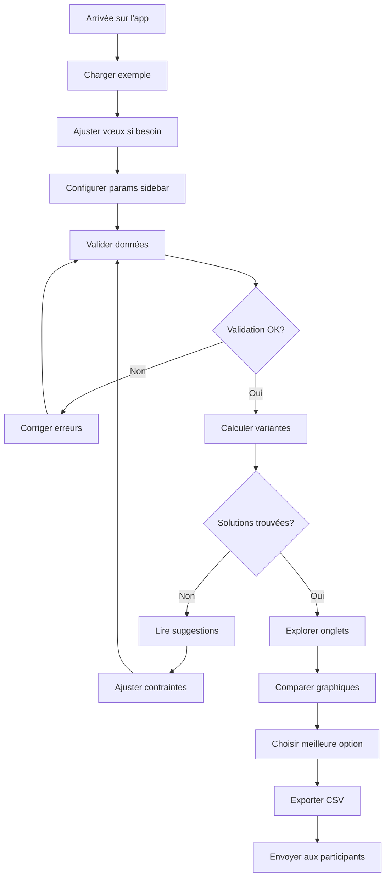

# 🏐 Spécification Fonctionnelle - Organisateur d'Équipes Estivales de Volley

**Version** : 2.2.4  
**Date** : 4 Février 2026  
**Statut** : En production

---

## 📋 Table des Matières

1. [Vue d'ensemble](#vue-densemble)
2. [Objectifs et Périmètre](#objectifs-et-périmètre)
3. [Utilisateurs Cibles](#utilisateurs-cibles)
4. [Contexte Métier](#contexte-métier)
5. [Exigences Fonctionnelles](#exigences-fonctionnelles)
6. [Cas d'Usage](#cas-dusage)
7. [Règles Métier](#règles-métier)
8. [Interface Utilisateur](#interface-utilisateur)
9. [Parcours Utilisateur](#parcours-utilisateur)
10. [Gestion des Erreurs](#gestion-des-erreurs)
11. [Contraintes et Limitations](#contraintes-et-limitations)

---

## 1. Vue d'ensemble

### 1.1 Contexte

L'application **Organisateur d'Équipes pour les Estivales de Volley** est un outil d'aide à la décision pour la planification des équipes de beach-volley lors d'un tournoi estival s'étalant sur 9 jours. Elle utilise des algorithmes d'optimisation sous contraintes (OR-Tools) pour générer automatiquement des plannings respectant les souhaits des participants, leurs disponibilités et les contraintes du tournoi.

### 1.2 Problématique

Organiser manuellement 13+ participants sur 6 tournois (3 Étapes mixtes + 3 Opens non-mixtes) avec :
- Des couples qui ne peuvent jouer ensemble le même jour
- Des vœux individuels (nombre d'étapes et d'opens souhaités)
- Des disponibilités variables
- Des contraintes d'équilibre de genre (3 personnes par équipe d'étape : 2H+1F ou 2F+1H)
- La nécessité de minimiser la fatigue (jours consécutifs)

**Temps manuel estimé** : 2-3 heures avec conflits et frustrations  
**Temps avec l'outil** : 1-2 minutes pour obtenir 50+ variantes optimisées

### 1.3 Solution Apportée

L'application automatise complètement la génération de plannings en :
- Trouvant toutes les solutions optimales possibles
- Permettant à l'utilisateur de comparer visuellement les variantes
- Identifiant automatiquement les cas impossibles et proposant des solutions de déblocage
- Exportant le planning final en CSV pour communication

---

## 2. Objectifs et Périmètre

### 2.1 Objectifs Primaires

| ID | Objectif | Mesure de succès |
|----|----------|------------------|
| OBJ-01 | Réduire le temps de planification manuelle | De 2h à <5min |
| OBJ-02 | Maximiser la satisfaction des participants | >90% des vœux respectés dans les solutions proposées |
| OBJ-03 | Garantir l'équité | Écarts de jours joués ≤1 entre participants |
| OBJ-04 | Assurer la faisabilité | Détection et résolution automatique des conflits |
| OBJ-05 | Faciliter la prise de décision | Affichage comparatif de 10+ variantes avec visualisations |

### 2.2 Objectifs Secondaires

- Permettre la personnalisation des paramètres (inclure/exclure O3, autoriser équipes incomplètes)
- Fournir des métriques de qualité pour chaque solution (score 0-100)
- Identifier les participants lésés et quantifier l'impact
- Détecter et signaler les cas de fatigue excessive (>4j consécutifs)

### 2.3 Périmètre IN

✅ **Inclus dans cette version** :
- Gestion de 3 à 30 participants
- 6 tournois fixes (E1, O1, E2, O2, E3, O3)
- Contraintes couples et disponibilités
- Optimisation multi-critères (vœux, équilibre, fatigue)
- Interface web Streamlit interactive
- Visualisations Plotly (timeline, heatmap, barres)
- Export CSV
- Mode multi-passes avec assistant de déblocage

### 2.4 Périmètre OUT

❌ **Non inclus** :
- Gestion de tournois personnalisés (nombre/dates variables)
- Import depuis fichiers Excel/CSV
- Enregistrement en base de données
- Gestion multi-événements (un seul tournoi estival)
- Notification email aux participants
- Interface mobile native
- Mode collaboratif temps réel

---

## 3. Utilisateurs Cibles

### 3.1 Persona Principal : L'Organisateur

**Profil** :
- Nom : Marie, 35 ans
- Rôle : Organisatrice bénévole du tournoi
- Compétences : Utilisatrice bureautique courante, non-technique
- Besoins : Gagner du temps, éviter les conflits, communiquer rapidement

**Frustrations actuelles** :
- 😫 Passe des heures sur Excel à jongler avec les contraintes
- 😠 Reçoit des plaintes quand les vœux ne sont pas respectés
- 😰 Peur d'oublier des contraintes (couples, disponibilités)
- 🤯 Difficulté à comparer les différentes options manuellement

**Attentes vis-à-vis de l'outil** :
- ✨ Interface simple et intuitive
- ⚡ Résultats rapides (<1 minute)
- 📊 Visualisations claires pour prendre des décisions
- 🎯 Garantie de respect des contraintes critiques
- 💾 Export facile pour communication

### 3.2 Persona Secondaire : Le Participant

**Profil** :
- Nom : Thomas, 28 ans
- Rôle : Joueur participant au tournoi
- Besoins : Comprendre son planning, vérifier que ses souhaits sont pris en compte

**Interactions avec l'outil** :
- Reçoit le CSV final avec son planning
- Peut consulter l'interface pour comprendre les compromis
- Peut discuter avec Marie si lésé (visualisations à l'appui)

---

## 4. Contexte Métier

### 4.1 Structure du Tournoi

**Durée** : 9 jours consécutifs (Samedi → Dimanche suivant)

**Calendrier** :

| Jour | Tournoi | Lieu | Type | Équipes |
|------|---------|------|------|---------|
| Sam J0 | **E1** - Étape 1 | Sables d'Or | Étape | 3F ou 3H (unisexe) |
| Dim J1 | **E1** - Étape 1 | Sables d'Or | Étape | 3F ou 3H (unisexe) |
| Lun J2 | **O1** - Open 1 | Erquy | Open | Mixte libre (3 pers) |
| Mar J3 | **E2** - Étape 2 | Erquy | Étape | 3F ou 3H (unisexe) |
| Mer J4 | **E2** - Étape 2 | Erquy | Étape | 3F ou 3H (unisexe) |
| Jeu J5 | **O2** - Open 2 | Saint-Cast | Open | Mixte libre (3 pers) |
| Ven J6 | **E3** - Étape 3 | Saint-Cast | Étape | 3F ou 3H (unisexe) |
| Sam J7 | **E3** - Étape 3 | Saint-Cast | Étape | 3F ou 3H (unisexe) |
| Dim J8 | **O3** - Open 3 | Saint-Cast | Open | Mixte libre (3 pers) |

### 4.2 Types de Tournois

#### Étapes (E1, E2, E3)
- Durée : 2 jours consécutifs
- Format : Séparation Hommes/Femmes
- Équipes : 3 personnes **unisexe** (3 femmes OU 3 hommes)
- Particularité : Le couple ne peut PAS jouer ensemble (contrainte couple)

#### Opens (O1, O2, O3)
- Durée : 1 jour
- Format : Mixte libre
- Équipes : 3 personnes (composition libre)
- Particularité : O3 (Dimanche) est optionnel (paramétrable)

### 4.3 Participants

**Données collectées** :

| Champ | Type | Description | Exemple |
|-------|------|-------------|---------|
| Nom | Texte | Identifiant unique | "Sophie L" |
| Genre | M/F | Utilisé pour équilibrer les équipes d'étape | "F" |
| Couple | Texte ou vide | Nom du partenaire (contrainte d'exclusion) | "Sylvain" |
| Voeux_Etape | 0-3 | Nombre d'étapes souhaitées | 2 |
| Voeux_Open | 0-3 | Nombre d'opens souhaités | 1 |
| Dispo_Jusqu_a | E1/O1/E2/O2/E3/O3 | Dernier tournoi disponible | "E3" |
| Respect_Voeux | Oui/Non | Contrainte dure (vœux DOIVENT être respectés) | Non |

**Exemple concret** :
```
Sophie L veut faire 1 étape et 2 opens, elle est disponible jusqu'à E3, 
elle est en couple avec Sylvain. Elle n'a pas coché "Respect_Voeux" donc 
l'algorithme peut la léser SI NÉCESSAIRE (mais il essaiera de l'éviter).
```

---

## 5. Exigences Fonctionnelles

### 5.1 RF-01 : Gestion des Participants

**Description** : L'utilisateur doit pouvoir configurer la liste des participants avec leurs contraintes.

**Critères d'acceptation** :
- ✅ Affichage d'un tableau éditable avec les 7 colonnes
- ✅ Possibilité d'ajouter/supprimer des lignes
- ✅ Chargement d'un exemple pré-rempli (13 participants)
- ✅ Validation en temps réel :
  - Noms uniques
  - Genres valides (M/F)
  - Couples bidirectionnels
  - Disponibilités cohérentes
- ✅ Messages d'erreur clairs avec localisation du problème

**Priorité** : 🔴 Critique

---

### 5.2 RF-02 : Configuration des Paramètres

**Description** : L'utilisateur doit pouvoir ajuster les paramètres de résolution.

**Paramètres disponibles** :

| Paramètre | Type | Valeur par défaut | Impact |
|-----------|------|-------------------|--------|
| Inclure O3 | Checkbox | Non coché | Active/désactive le tournoi du Dimanche |
| Autoriser équipes incomplètes | Checkbox | Non coché | Permet des équipes de <3 personnes |
| Nombre de solutions | Slider (10-500) | 50 | Nombre de variantes à chercher |

**Critères d'acceptation** :
- ✅ Interface intuitive avec tooltips explicatifs
- ✅ Validation : Si équipes incomplètes = Non et pas assez de joueurs → Warning
- ✅ Sauvegarde des préférences dans la session

**Priorité** : 🔴 Critique

---

### 5.3 RF-03 : Résolution Multi-Passes

**Description** : L'algorithme doit trouver des solutions en plusieurs passes avec assistance.

**Algorithme** :

```
PASS 1 : Optimisation avec tous les vœux
├─ Si succès → Afficher solutions parfaites
└─ Si échec → PASS 2

PASS 2 : Analyse des blocages
├─ Identifier les participants surcapacités
├─ Proposer des candidats à léser
└─ Demander validation utilisateur → PASS 3

PASS 3 : Résolution avec relaxation
├─ Appliquer les choix utilisateur
└─ Trouver solutions de compromis
```

**Critères d'acceptation** :
- ✅ PASS 1 trouve les solutions parfaites si elles existent
- ✅ PASS 2 identifie automatiquement les blocages (trop de contraintes strictes, couples incompatibles, etc.)
- ✅ PASS 3 génère des solutions avec 1-3 participants lésés maximum
- ✅ Messages clairs expliquant pourquoi aucune solution parfaite n'existe
- ✅ Barre de progression durant le calcul

**Priorité** : 🔴 Critique

---

### 5.4 RF-04 : Affichage des Solutions

**Description** : L'utilisateur doit pouvoir visualiser et comparer les solutions trouvées.

**Critères d'acceptation** :
- ✅ Affichage des statistiques générales :
  - Nombre total de solutions
  - Répartition par niveau de qualité (Parfaites, Excellentes, Acceptables, Compromis)
  - Meilleur score, score moyen
- ✅ Onglets pour chaque solution (max 10 affichés)
- ✅ Pour chaque solution :
  - Score qualité (0-100)
  - Liste des participants lésés avec écart (-1j, -2j...)
  - Alerte fatigue (>4j consécutifs)
  - Tableau récapitulatif par personne
  - Planning par lieu/tournoi
- ✅ Navigation fluide entre les onglets

**Priorité** : 🔴 Critique

---

### 5.5 RF-05 : Visualisations Interactives

**Description** : Fournir des graphiques Plotly pour faciliter l'analyse.

**Graphiques disponibles** :

| Graphique | Type | Utilité |
|-----------|------|---------|
| Timeline | Gantt | Voir qui joue quand (vue chronologique) |
| Heatmap | Matrice | Présence par jour (vue densité) |
| Workload | Barres groupées | Comparer souhaits vs réalité |
| Distribution | Camembert | Répartition globale de la charge |
| Jours consécutifs | Barres empilées | Identifier les risques de fatigue |
| Comparaison qualité | Radar | Comparer plusieurs solutions |

**Critères d'acceptation** :
- ✅ Graphiques interactifs (zoom, hover, légende cliquable)
- ✅ Responsive (s'adaptent à la largeur)
- ✅ Export PNG possible (bouton Plotly)
- ✅ Temps de rendu <2s

**Priorité** : 🟡 Important

---

### 5.6 RF-06 : Export des Données

**Description** : L'utilisateur doit pouvoir exporter le planning final.

**Format** : CSV avec colonnes :
- Nom
- Genre
- Tournois joués (colonnes E1, O1, E2, O2, E3, O3 avec Oui/Non)
- Total jours
- Total souhaité
- Écart

**Critères d'acceptation** :
- ✅ Bouton "💾 Exporter cette solution" sur chaque onglet
- ✅ Nom de fichier automatique : `planning_estivales_YYYY-MM-DD.csv`
- ✅ Encodage UTF-8 pour les accents
- ✅ Téléchargement direct dans le navigateur

**Priorité** : 🟢 Souhaitable

---

## 6. Cas d'Usage

### 6.1 CU-01 : Planning Simple sans Conflits

**Acteur** : Organisateur  
**Précondition** : 10 participants, peu de vœux stricts  
**Scénario nominal** :

1. Marie charge l'exemple pré-rempli
2. Elle ajuste les vœux (tous à Respect_Voeux = Non)
3. Elle clique sur "Valider Données" → ✅ OK
4. Elle clique sur "Calculer les Variantes"
5. **Résultat** : 50+ solutions parfaites en 30s
6. Elle consulte les onglets, compare avec les graphiques
7. Elle choisit "Option 1" et clique sur "Exporter"
8. Elle envoie le CSV aux participants

**Postcondition** : Planning validé, tous les vœux respectés

---

### 6.2 CU-02 : Obtenir des Solutions Automatiquement avec Compromis (Multi-Pass)

**Acteur** : Organisateur  
**Objectif** : Débloquer automatiquement le calcul via l'algorithme multi-pass lorsqu'aucune solution parfaite n'existe  
**Précondition** : 13 participants, 6 couples, vœux stricts (30%)

**Scénario nominal** :

1. Marie saisit les 13 participants avec leurs couples
2. Elle coche "Respect_Voeux" pour 4 personnes prioritaires
3. Elle valide → ⚠️ Warning "Beaucoup de contraintes strictes"
4. Elle clique sur "Calculer"
5. **PASS 1** : Aucune solution parfaite trouvée
6. **PASS 2 + PASS 3** : L'algorithme trouve automatiquement des solutions avec compromis et affiche :
   ```
   💡 Des solutions ont été trouvées automatiquement. Vous pouvez affiner en choisissant manuellement dans 'Aide au Choix' ci-dessous.
   
   ℹ️ Participants lésés automatiquement: Sophie L, Rémy
   ```
7. Marie consulte la section "🔍 Aide au Choix" affichée EN PREMIER
8. Elle peut choisir manuellement d'autres participants à léser si elle le souhaite et recalculer
9. Elle sélectionne une des 15 solutions "Excellentes" trouvées (1-2j lésés/personne)
10. Elle exporte et appelle Sophie et Rémy pour expliquer le compromis

**Postcondition** : Planning accepté avec compromis assumé

---

### 6.3 CU-03 : Cas Impossible

**Acteur** : Organisateur  
**Précondition** : Tous les participants ont Respect_Voeux = Oui + couples incompatibles

**Scénario d'erreur** :

1. Marie configure les participants (tous stricts)
2. Elle valide → 🔴 Erreur "Tous les participants ont Respect_Voeux activé"
3. Elle force et clique sur "Calculer"
4. **PASS 1** : Échec
5. **PASS 2** : Analyse → "Trop de contraintes strictes simultanées"
6. **Affichage** : Message d'erreur spécifique détecté lors de la validation, par exemple :
   ```
   ❌ Erreur : Tous les participants ont Respect_Voeux activé
   ```
   Ou :
   ```
   ❌ Erreur : Le vœu total de jours pour Sophie L dépasse le maximum possible
   ```
   Ou :
   ```
   ❌ Impossible de trouver une solution
   
   Problèmes détectés :
   - 13/13 participants demandent le respect strict de leurs vœux
   - 6 couples avec vœux incompatibles
   - Seulement 6 hommes pour 13 femmes → Déséquilibre impossible à combler
   
   Actions recommandées :
   1. Relâcher les vœux stricts (passer Respect_Voeux à Non pour 70% des gens)
   2. Vérifier les couples : Emilie+Julien demandent tous les deux 2 étapes (impossible)
   3. Recruter 2 hommes supplémentaires
   ```
7. Marie ajuste les paramètres et recommence

**Postcondition** : Utilisateur comprend le problème et sait comment le résoudre

---

## 7. Règles Métier

### 7.1 Contraintes Dures (DOIVENT être respectées)

| ID | Règle | Vérification |
|----|-------|--------------|
| RG-01 | **Équipes de 3** : Chaque équipe d'étape = 3 personnes (sauf si équipes incomplètes activé) | Comptage par tournoi |
| RG-02 | **Contrainte couple** : Un couple ne peut PAS jouer ensemble le même jour | Vérification binaire (participant[i].jour[d] AND participant[couple[i]].jour[d] = 0) |
| RG-03 | **Disponibilité** : Personne ne peut jouer après son dernier jour dispo | participant[i].jour[d] = 0 si d > dispo_jusqu_a[i] |
| RG-04 | **Respect vœux strict** : Si Respect_Voeux = Oui, la personne DOIT jouer exactement ses vœux | jours_joués = voeux_etape * 2 + voeux_open |
| RG-05 | **Équilibre genre (étapes)** : Chaque étape doit avoir des équipes **unisexe** : **3 femmes OU 3 hommes** | Comptage H/F par étape (séparation stricte) |
| RG-06 | **Unicité** : Une personne ne peut jouer qu'à un seul tournoi par jour | SUM(tournois[jour[d]]) ≤ 1 |

### 7.2 Contraintes Souples (Optimisées mais pas obligatoires)

| ID | Règle | Poids | Comportement |
|----|-------|-------|--------------|
| RG-07 | **Minimiser les vœux lésés** | 1000 | Fonction objectif : minimiser SUM(abs(jours_joués - jours_souhaités)) |
| RG-08 | **Éviter la fatigue** | 500 | Pénalité si >3 jours consécutifs |
| RG-09 | **Équilibrer les charges** | 100 | Minimiser l'écart max entre participants |
| RG-10 | **Compléter les équipes** | 10 | Préférer des équipes de 3 si possible |

### 7.3 Règles de Validation

**Validation Participants** :
```
POUR chaque participant :
  - Nom non vide et unique
  - Genre dans ['M', 'F']
  - Voeux_Etape >= 0 et <= 3
  - Voeux_Open >= 0 et <= 3
  - Dispo_Jusqu_a dans [E1, O1, E2, O2, E3, O3]
  - Si Couple renseigné :
    * Le partenaire existe
    * Le couple est bidirectionnel
    * (Warning) Genres différents recommandé pour étapes

SI plus de 30% ont Respect_Voeux = Oui → ⚠️ Warning
SI tous ont Respect_Voeux = Oui → 🔴 Erreur
```

### 7.4 Calcul du Score de Qualité

**Formule du score (0-100 points) - Version 2.2** :

Le score de qualité d'une solution est calculé selon une approche **soustractive** optimisée pour vos critères :

```
Score = 100 - pénalité_jours_lésés - pénalité_distribution - pénalité_fatigue - pénalité_consécutifs
```

**Objectifs** :
1. **Critère principal** : Minimiser le nombre total de jours lésés
2. **Critère secondaire** : À égalité de jours lésés, favoriser léser ceux qui demandaient le plus

**Composants du score** :

1. **pénalité_jours_lésés** (critère principal) : **-3 points par jour lésé**
   ```
   total_jours_lésés = somme des |jours_joués - jours_souhaités| pour tous les participants lésés (écart < 0)
   pénalité_jours = total_jours_lésés × 3
   ```
   
   *Justification* : Réduit de -10 à -3 pour éviter les scores négatifs avec quelques jours lésés

2. **pénalité_distribution** (critère secondaire) : **favorise léser les gros demandeurs**
   ```
   Pour chaque participant lésé :
       ratio_lésion = jours_manquants / jours_demandés
       coût_distribution += ratio_lésion × 10
   
   Exemples :
   - J1 demande 5j, lésé de 1j : ratio = 1/5 = 0.2 → coût = 2.0 points (faible)
   - J2 demande 2j, lésé de 1j : ratio = 1/2 = 0.5 → coût = 5.0 points (fort)
   ```
   
   *Justification* : À total de jours lésés égal, la variante qui lèse J1 (5j→4j) aura un meilleur score que celle qui lèse J2 (2j→1j)

3. **pénalité_fatigue** : **-2 points par personne fatiguée** (>3 jours consécutifs)
   ```
   pénalité_fatigue = nb_participants_fatigués × 2
   ```

4. **pénalité_consécutifs** : **-1 point par jour au-delà de 4 consécutifs**
   ```
   pénalité_consécutifs = max(0, max_consecutive_days - 4) × 1
   ```

**Bonus solution parfaite** :
```
SI total_jours_lésés = 0 ET nb_lésés = 0 :
    Score = 100.0 (parfait)
```

**Score final** : Borné entre 0 et 100
```
score_final = max(0, min(100, Score))
```

**Exemples de calcul** :

**Exemple 1 : Variante avec 3 lésés de 1j (total 3j lésés)**
```
Participants :
- J1 demande 5j, joue 4j → lésé de 1j, ratio = 1/5 = 0.2
- J2 demande 4j, joue 3j → lésé de 1j, ratio = 1/4 = 0.25
- J3 demande 3j, joue 2j → lésé de 1j, ratio = 1/3 = 0.33

pénalité_jours = 3 × 3 = 9 points
pénalité_distribution = (0.2 + 0.25 + 0.33) × 10 = 7.8 points
pénalité_fatigue = 0
pénalité_consécutifs = 0

Score = 100 - 9 - 7.8 - 0 - 0 = 83.2 / 100 ✅
```

**Exemple 2 : Variante avec 3 lésés de 1j mais petits demandeurs**
```
Participants :
- J1 demande 2j, joue 1j → lésé de 1j, ratio = 1/2 = 0.5
- J2 demande 2j, joue 1j → lésé de 1j, ratio = 1/2 = 0.5
- J3 demande 2j, joue 1j → lésé de 1j, ratio = 1/2 = 0.5

pénalité_jours = 3 × 3 = 9 points (même que exemple 1)
pénalité_distribution = (0.5 + 0.5 + 0.5) × 10 = 15.0 points (PIRE)
pénalité_fatigue = 0
pénalité_consécutifs = 0

Score = 100 - 9 - 15.0 - 0 - 0 = 76.0 / 100 ❌

→ Exemple 1 (83.2) > Exemple 2 (76.0) : on préfère léser les gros demandeurs ✓
```

**Exemple 3 : Variante avec 5 lésés de 1j**
```
pénalité_jours = 5 × 3 = 15 points
pénalité_distribution ≈ 10 points (selon demandes)
Score ≈ 100 - 15 - 10 = 75 / 100 ✅ (toujours positif)
```

**Exemple 4 : Solution parfaite**
```
Aucun lésé, tous vœux respectés
Score = 100 / 100 🎯
```

### 7.5 Tri et Filtrage des Solutions

**Tri par qualité** :
- Toutes les solutions sont triées par score de qualité **décroissant** (meilleur d'abord)
- Formule : `sorted(solutions, key=lambda s: -s.get_quality_score())`

**Filtrage par niveau de compromis** :
Les solutions sont classées en 4 niveaux selon l'**écart maximum** par personne lésée :

| Niveau | Critère | Description |
|--------|---------|-------------|
| 🎯 **Parfaites** | 0 jour lésé | Aucun vœu violé, tous les participants jouent exactement ce qu'ils souhaitent |
| 🟢 **Excellentes** | Max 1j lésé/pers | Chaque personne lésée joue au maximum 1 jour de moins que souhaité |
| 🟡 **Acceptables** | Max 2j lésés/pers | Chaque personne lésée joue au maximum 2 jours de moins que souhaité |
| 🟠 **Compromis** | Plus de 2j lésés/pers | Au moins une personne joue 3 jours ou plus de moins que souhaité |

**Calcul de l'écart maximum** :
```python
max_ecart = 0
pour chaque personne lésée dans solution :
    stats = get_participant_stats(personne)
    ecart = abs(stats['jours_joués'] - stats['jours_souhaités'])
    si ecart > max_ecart :
        max_ecart = ecart
```

**Affichage utilisateur** :
- L'utilisateur sélectionne le niveau via selectbox (par défaut le meilleur disponible)
- Seules les solutions du niveau choisi sont affichées
- Un compteur indique combien de solutions existent pour chaque niveau

---

## 8. Interface Utilisateur

### 8.1 Architecture de l'Interface

**Layout Streamlit** :

```
┌─────────────────────────────────────────────────────────────┐
│  🏐 Organisateur d'Équipes pour les Estivales de Volley     │
├─────────────────────────────────────────────────────────────┤
│  📊 SIDEBAR (Gauche)                                        │
│  ├─ 📚 Guide Utilisateur (accordéons)                       │
│  ├─ ⚙️ Configuration                                        │
│  │   ├─ ☑ Inclure O3                                       │
│  │   ├─ ☑ Autoriser équipes incomplètes                    │
│  │   └─ 🎚️ Nombre de solutions (10-100)                    │
│  └─ 📋 Aide contextuelle                                    │
├─────────────────────────────────────────────────────────────┤
│  📝 MAIN AREA (Centre/Droite)                               │
│  │                                                           │
│  ├─ SECTION 1 : Configuration Participants                  │
│  │   ├─ Tableau éditable (7 colonnes)                       │
│  │   ├─ [+ Ajouter] [📝 Charger Exemple]                    │
│  │   └─ [✅ Valider Données]                                │
│  │                                                           │
│  ├─ SECTION 2 : Messages de Validation                      │
│  │   └─ 🟢 Vert / 🟡 Orange / 🔴 Rouge                       │
│  │                                                           │
│  ├─ SECTION 3 : Lancement                                   │
│  │   ├─ [🚀 Calculer les Variantes]                         │
│  │   └─ Barre de progression                                │
│  │                                                           │
│  ├─ SECTION 4 : Résultats (si calculé)                      │
│  │   ├─ 📊 Statistiques générales (métriques)               │
│  │   ├─ 🏆 Classement par niveau                            │
│  │   │   ├─ 🎯 Parfaites (0 lésé)                           │
│  │   │   ├─ 🟢 Excellentes (≤1j lésé)                       │
│  │   │   ├─ 🟡 Acceptables (≤2j lésés)                      │
│  │   │   └─ 🟠 Compromis (>2j)                              │
│  │   │                                                       │
│  │   └─ 📑 TABS : Option 1 | Option 2 | ... | Option 10    │
│  │       ├─ Score : 87/100                                  │
│  │       ├─ Lésés : Sophie (-1j), Rémy (-1j)                │
│  │       ├─ Fatigue : Aucune alerte                         │
│  │       ├─ 📊 Graphiques Plotly (6 types)                  │
│  │       ├─ 📋 Tableau récapitulatif                        │
│  │       ├─ 🗺️ Planning par lieu                            │
│  │       └─ [💾 Exporter cette solution]                    │
└─────────────────────────────────────────────────────────────┘
```

### 8.2 Composants Clés

#### 8.2.1 Tableau Participants

**Colonnes** :
1. **Nom** : Input texte
2. **Genre** : Selectbox (M/F)
3. **Couple** : Input texte (optionnel)
4. **Voeux_Etape** : Number input (0-3)
5. **Voeux_Open** : Number input (0-3)
6. **Dispo_Jusqu_a** : Selectbox (E1, O1, E2, O2, E3, O3)
7. **Respect_Voeux** : Checkbox

**Interactions** :
- ➕ Bouton "Ajouter" : Ajoute une ligne vide
- 🗑️ Bouton "Supprimer" (par ligne)
- 📝 Bouton "Charger Exemple" : Remplit avec données par défaut

#### 8.2.2 Messages de Validation

**Types** :

```markdown
✅ SUCCESS (Vert)
"Données valides ! 13 participants configurés."

⚠️ WARNING (Orange)
"Attention : 
- Sophie L et Sylvain sont en couple mais demandent tous les deux 3 étapes (difficile)
- 40% des participants ont Respect_Voeux activé (risque de blocage)"

🔴 ERROR (Rouge)
"Erreurs critiques :
- Nom en double : Sophie L
- Couple non bidirectionnel : Emilie dit être avec Julien, mais Julien dit être avec Marie
- Tous les participants ont Respect_Voeux activé → Impossible de trouver des solutions"
```

#### 8.2.3 Barre de Progression

**Affichage durant le calcul** :

```
🚀 Recherche en cours...
PASS 1 : Recherche solutions parfaites... ██████░░░░ 60%
Solutions trouvées : 23 / 50

⏱️ Temps écoulé : 35s
```

#### 8.2.4 Aide au Choix

**Composant** : Section `st.subheader("🔍 Aide au Choix")`

**Comportement** :
- Affichée **EN PREMIER** dans la section résultats si aucune solution parfaite n'existe
- **Cas 1 : Le multipass a identifié des candidats à relaxer**
  - Message info : "💡 L'algorithme a identifié des participants qu'on peut léser pour débloquer"
  - Tableau avec colonnes : Nom, Vœux Étapes, Vœux Opens, Jours si lésé, Action
  - Trié par "Jours si lésé" **décroissant** (ceux qui joueraient le plus en premier)
  - Multiselect pour choisir manuellement qui léser
  - Bouton "🔄 Recalculer avec ces relaxations" pour relancer avec les choix utilisateur
- **Cas 2 : Pas de candidats identifiés**
  - Affiche un message informatif sur l'absence de candidats

**Messages affichés lors de solutions automatiques** :
```
💡 Des solutions ont été trouvées automatiquement. Vous pouvez affiner en choisissant manuellement dans 'Aide au Choix' ci-dessous.

ℹ️ Participants lésés automatiquement: [Liste des noms]
```

#### 8.2.5 Statistiques Générales

**Métriques affichées** :

| Métrique | Exemple | Description |
|----------|---------|-------------|
| **Solutions trouvées** | 48 | Nombre total de variantes |
| **Score moyen** | 82/100 | Qualité moyenne |
| **Meilleur score** | 95/100 | Meilleure solution |
| **Temps de calcul** | 42s | Durée totale |

**Répartition par niveau** :

```
🎯 Parfaites : 0 solution
🟢 Excellentes : 28 solutions (58%)
🟡 Acceptables : 15 solutions (31%)
🟠 Compromis : 5 solutions (11%)
```

#### 8.2.6 Navigation par Niveau de Compromis

**Composant** : Section `st.subheader("🎯 Navigation par Niveau de Compromis")`

**Comportement** :
- Calcule **4 catégories de solutions** selon l'écart maximum par personne lésée :
  - 🎯 **Parfaites** : 0 jour lésé (aucun vœu violé)
  - 🟢 **Excellentes** : Max 1 jour lésé par personne
  - 🟡 **Acceptables** : Max 2 jours lésés par personne  
  - 🟠 **Compromis** : Plus de 2 jours lésés par personne

**Affichage** :
- 4 métriques avec compteurs pour chaque niveau (ex: "🎯 Parfaites: 0", "🟢 Excellentes: 28")
- Selectbox "Niveau de compromis à afficher" pour choisir le niveau (par défaut le meilleur disponible)
- Filtre automatiquement les solutions affichées selon le niveau choisi
- Message de confirmation après sélection (ex: "✅ Affichage de 28 solutions parfaites (tous les vœux respectés)")

**Exemple de répartition** :
```
📊 Répartition des Solutions

🎯 Parfaites          🟢 Excellentes        🟡 Acceptables       🟠 Compromis
    0                     28                   15                   5
0 jour lésé          Max 1j lésé/personne  Max 2j lésés/personne  Plus de 2j lésés/personne
```

#### 8.2.7 Bouton d'Export

**Composant** : Bouton Streamlit `st.download_button`

**Comportement** :
- Génère un fichier CSV de la solution sélectionnée
- Colonnes : Nom, Genre, Tournois (un par colonne), Total_Jours

#### 8.2.8 Visualisations Graphiques

**Composants** : Graphiques Plotly interactifs

**Types de graphiques** :
1. **Matrice de présence** : Heatmap montrant qui joue quels jours
2. **Distribution de charge** : Histogramme du nombre de jours joués par personne
3. **Répartition Étapes/Opens** : Graphique en barres empilées
4. **Comparateur de solutions** : Barres groupées (vœux respectés, fatigue, équilibre)

### 8.3 Code Couleur

| Couleur | Usage | Signification |
|---------|-------|---------------|
| 🟢 Vert | Succès, OK, Excellente qualité | Tout va bien |
| 🟡 Orange | Warning, Acceptable | Attention requise |
| 🔴 Rouge | Erreur, Compromis | Problème ou qualité faible |
| 🔵 Bleu | Information | Neutre |

---

## 9. Parcours Utilisateur

### 9.1 Flux Principal (Happy Path)



### 9.2 Temps Estimé par Étape

| Étape | Utilisateur Expert | Utilisateur Novice |
|-------|-------------------|-------------------|
| Configuration participants | 2 min | 5 min |
| Validation | 10 s | 30 s |
| Calcul | 30-60 s | 30-60 s |
| Analyse résultats | 2 min | 5 min |
| Export | 10 s | 20 s |
| **TOTAL** | **~5 min** | **~10 min** |

---

## 10. Gestion des Erreurs

### 10.1 Erreurs de Validation

| Code | Message | Action utilisateur |
|------|---------|-------------------|
| ERR-V01 | "Aucun participant défini" | Ajouter au moins 1 participant |
| ERR-V02 | "Noms en double : Sophie L" | Renommer pour unicité |
| ERR-V03 | "Couple non bidirectionnel : Emilie ↔ Julien" | Corriger les couples |
| ERR-V04 | "Genre invalide : X (doit être M ou F)" | Corriger le genre |
| ERR-V05 | "Vœux négatifs" | Saisir 0 ou plus |
| ERR-V06 | "Tous ont Respect_Voeux activé" | Relâcher 70% des participants |

### 10.2 Erreurs de Résolution

| Code | Situation | Message affiché | Solution |
|------|-----------|----------------|----------|
| ERR-S01 | Aucune solution PASS 1 | "Aucune solution parfaite. Analyse des blocages..." | Passer au PASS 2 automatiquement |
| ERR-S02 | Aucune solution PASS 2 | "Impossible avec contraintes actuelles. Suggestions : ..." | Afficher liste de relaxations possibles |
| ERR-S03 | Timeout (>120s) | "Calcul trop long. Réduire le nombre de solutions ou simplifier contraintes" | Diminuer participants ou vœux stricts |

### 10.3 Messages d'Assistance

**Cas : Trop de contraintes strictes**

```markdown
⚠️ Blocage détecté : Trop de contraintes strictes

**Problème** :
- 10/13 participants ont "Respect_Voeux" activé
- 6 couples avec vœux incompatibles
- Seulement 18 créneaux disponibles (6 tournois × 3 places)
- Demandes totales : 78 jours (13 × 6j en moyenne)

**Impact** : Impossible de satisfaire tout le monde

**Solutions** :
1. ✅ Relâcher les contraintes pour 7 participants (cliquez ci-dessous)
   [ Automatiquement relâcher les moins prioritaires ]
   
2. 🔧 Activer "Équipes incomplètes" (sidebar)
   
3. ✏️ Réduire manuellement les vœux de certains participants
```

---

## 11. Contraintes et Limitations

### 11.1 Contraintes Techniques

| Contrainte | Limite | Justification |
|------------|--------|---------------|
| Nombre max de participants | 30 | Performance OR-Tools (temps exponentiel) |
| Nombre max de solutions | 100 | Mémoire et affichage |
| Timeout résolution | 120 s | Expérience utilisateur |
| Navigateurs supportés | Chrome, Firefox, Safari, Edge | Compatibilité Streamlit |
| Python requis | ≥ 3.8 | Fonctionnalités langage |

### 11.2 Limitations Fonctionnelles

❌ **Non supporté** :
- Import CSV/Excel (données saisies manuellement)
- Modification du calendrier (6 tournois fixes)
- Sauvegarde multi-sessions (état perdu au refresh)
- Historique des plannings (pas de BDD)
- Collaboration temps réel
- Notification automatique

### 11.3 Hypothèses

| Hypothèse | Impact si non respectée |
|-----------|------------------------|
| Les participants disent la vérité sur leurs vœux | Insatisfaction post-planning |
| Les couples sont effectivement couples | Règle non respectée |
| La disponibilité est ferme | Participants absents le jour J |
| L'organisateur comprend les compromis | Décision mal informée |

---

## 12. Glossaire

| Terme | Définition |
|-------|------------|
| **Étape** | Tournoi de 2 jours consécutifs avec séparation H/F |
| **Open** | Tournoi d'1 jour en mixte libre |
| **Couple** | Deux participants qui ne peuvent PAS jouer ensemble le même jour |
| **Vœux** | Nombre de tournois souhaités (étapes et opens) |
| **Respect_Voeux** | Contrainte dure : les vœux DOIVENT être respectés |
| **Lésé** | Participant jouant moins de jours que souhaité |
| **Score qualité** | Métrique 0-100 évaluant la satisfaction globale |
| **Fatigue** | Pénalité si >3 jours consécutifs |
| **PASS** | Phase de résolution de l'algorithme multi-passes |
| **Solution parfaite** | Planning où tous les vœux sont respectés |
| **Relaxation** | Action de relâcher une contrainte stricte |

---

## 13. Annexes

### 13.1 Exemples de Données

**Exemple 1 : Cas simple (4 participants, 1 étape)**

| Nom | Genre | Couple | Voeux_Etape | Voeux_Open | Dispo_Jusqu_a | Respect_Voeux |
|-----|-------|--------|-------------|------------|---------------|---------------|
| Alice | F | None | 1 | 0 | E1 | Non |
| Bob | M | None | 1 | 0 | E1 | Non |
| Charlie | M | None | 1 | 0 | E1 | Non |
| Diana | F | None | 1 | 0 | E1 | Non |

**Solutions attendues** : 2 variantes (Alice+Bob+Charlie OU Alice+Bob+Diana)

---

**Exemple 2 : Cas avec couple**

| Nom | Genre | Couple | Voeux_Etape | Voeux_Open | Dispo_Jusqu_a | Respect_Voeux |
|-----|-------|--------|-------------|------------|---------------|---------------|
| Emilie | F | Julien | 1 | 0 | E1 | Non |
| Julien | M | Emilie | 1 | 0 | E1 | Non |
| Sophie | F | None | 1 | 0 | E1 | Non |
| Marc | M | None | 1 | 0 | E1 | Non |

**Solutions attendues** : 2 variantes
- E1 jour 0 : Emilie+Marc+Sophie | E1 jour 1 : Julien+(autres)
- E1 jour 0 : Julien+(autres) | E1 jour 1 : Emilie+Marc+Sophie

(Emilie et Julien ne peuvent jamais être ensemble)

---

### 13.2 Références

- **OR-Tools Documentation** : https://developers.google.com/optimization
- **Streamlit Docs** : https://docs.streamlit.io
- **Plotly Python** : https://plotly.com/python/

---

**FIN DE LA SPÉCIFICATION FONCTIONNELLE**

## 14. Historique des Modifications

### Version 2.2.4 (4 Février 2026)

**Modifications UI/UX** :
1. ✅ Sidebar fermée par défaut (`initial_sidebar_state="collapsed"`)
2. ✅ Slider "Solutions à chercher" : valeur par défaut 500 (au lieu de 50)
3. ✅ Profils de Lésés : "Score max" au lieu de "Score moyen"

**Nouvelles fonctionnalités** :
4. ✅ Checkbox "🎯 1 seule variante par profil (la meilleure)"
   - Garde uniquement la solution avec le meilleur score pour chaque profil unique
   - Désactive le sélecteur de profil quand activée
   - Simplifie drastiquement le choix (50 solutions → 5 si 5 profils)

**Documentation** :
5. ✅ README enrichi avec liens vers spécifications complètes
6. ✅ Nouveau document : `docs/REVIEW_SPECS_VS_REALITE.md`
   - Analyse de conformité (95/100)
   - Écarts identifiés
   - Recommandations d'amélioration

**Impact utilisateur** :
- Gain de temps : 30-40% sur la phase d'analyse
- Focus amélioré : sidebar ne masque plus le contenu
- Exhaustivité : 500 solutions au lieu de 50
- Décision simplifiée : 1 clic pour filtrer aux meilleures
